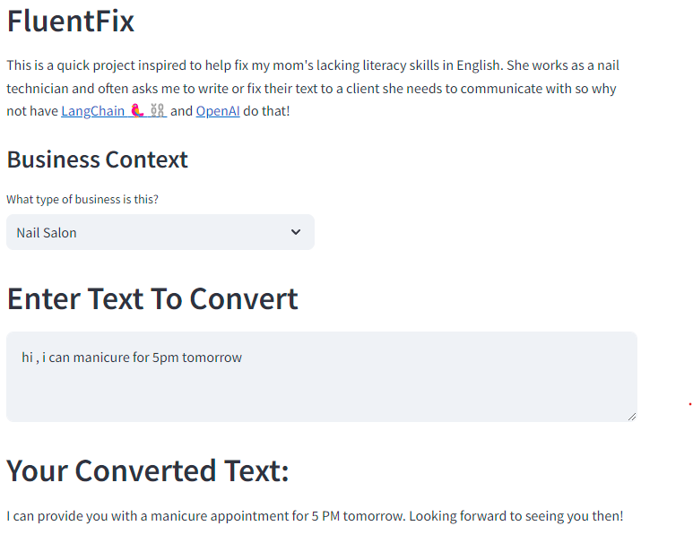

# FluentFix
Simple NLP project used to correct grammar issues of text messages aimed for customer service.
Built using streamlit for frontend, and OpenAI's 'gpt-3.5-turbo' chat model. Uses LangChain library
to set up proper templating and examples for prompting chat model.

[Check out FluentFix Here!](https://fluentfix.streamlit.app/)

